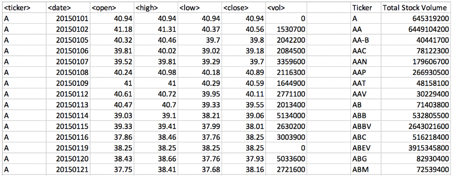

# The VBA of Wall Street
# Background:
Use VBA scripting to analyze real stock market data.

# Steps
   * Create a script that will loop through one year of stock data for each run and return the total volume each stock had over that year.
   * Display the ticker symbol to coincide with the total stock volume.
   * The result looks as follows (note: all solution images are for 2015 data).

### Contents
  * VBA Scripts and Screenshots of Each Year(1014, 2015, 2016)
  * The .bas file contain the scripts used to run through the sheets.
